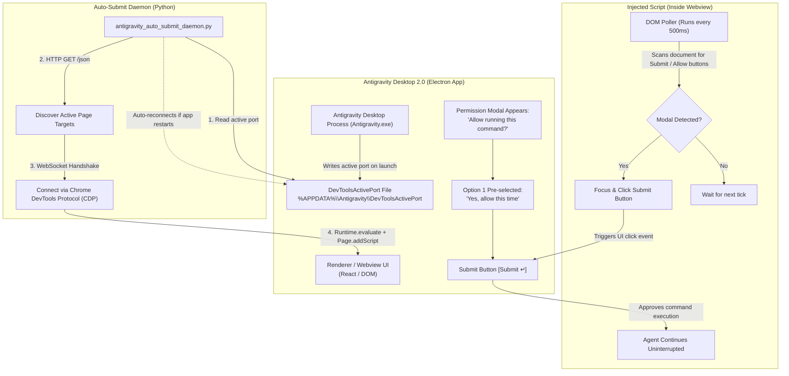

# 🚀 Antigravity Desktop 2.0 Auto-Submit Daemon

> **The ultimate hands-free (YOLO mode) automation daemon for Google Antigravity Desktop Agent (v2.0)**  
> Automatically detects and approves confirmation prompts (*"Allow running this command?"*, *"Allow verifying compilation..."*) using internal **Chrome DevTools Protocol (CDP)** injection — zero extensions or DevTools menu required.

[English](README.md) | [Tiếng Việt](README_vi.md)

[](LICENSE)
[]()
[]()
[]()

---

## 📌 Problem Statement

In the **Google Antigravity Desktop 2.0 (Standalone Agent App)**:
1. **Endless Permission Modals**: Every time the agent tries to run terminal commands (`git`, `Get-Process`, `python`, `py_compile`), it pauses execution and waits for manual approval (`Submit ↵` or `Allow`).
2. **Dynamic Commands Break "Always Allow"**: Even if you click *"always allow in this project"*, commands with dynamic parameters (e.g. process IDs in `Get-Process -Id <PID>`, newly generated filenames, or compiler arguments) are treated as new commands, constantly interrupting the workflow.
3. **Hidden Developer Tools**: In recent production builds, Google removed the `View -> Toggle Developer Tools` option from the menu bar, preventing developers from manually pasting console workarounds.

---

## 🏗️ Architecture & Workflow Diagram

Antigravity Desktop is built on **Electron**. Even when Developer Tools are hidden from the menu, Electron automatically spins up a local debugging endpoint and writes the active port to:
`%APPDATA%\Antigravity\DevToolsActivePort`



---

## 💡 Key Features

* **⚡ Native CDP Injection**: Directly communicates with Antigravity Desktop's Electron renderer via Chrome DevTools Protocol WebSocket.
* **🔄 Self-Healing / Auto-Reconnecting**: Automatically senses if Antigravity restarts or changes ports, seamlessly re-injecting the script.
* **📑 Persistent Across Conversations**: Registers `Page.addScriptToEvaluateOnNewDocument` so the auto-submitter remains active when opening new chat tabs or reloading.
* **🪟 Stealth / Zero-Window Mode**: Run silently in the background with zero terminal popups via the provided VBScript launcher.

---

## 🛠️ Quick Installation

### Prerequisites
* Windows 10 / 11
* Python 3.9+ installed and on `PATH`
* Install required dependencies:
  ```powershell
  pip install -r requirements.txt
  ```

---

## 🚀 How to Run

Pre-configured launchers are provided in the `launchers/` directory:

### Method 1: Interactive Console Mode (Recommended for first run)
* Double-click [`launchers/Auto_Submit_Antigravity.bat`](launchers/Auto_Submit_Antigravity.bat).
* Opens a command prompt window showing live connection logs and click timestamps.

### Method 2: Silent Background Mode (Zero Console Window)
* Double-click [`launchers/Chay_Ngam_Auto_Submit.vbs`](launchers/Chay_Ngam_Auto_Submit.vbs).
* Runs completely hidden in the background without any command prompt window.

### Method 3: Run Manually with Python
```powershell
py -3 -u scripts/antigravity_auto_submit_daemon.py
```

**Optional CLI Arguments:**
* `--interval 1.5`: Polling interval for detecting Antigravity process/port (default: `2.0`s).
* `--button-check-ms 400`: Frequency for checking the DOM for Submit buttons (default: `500`ms).

### Method 4: Stop Daemon
* Double-click [`launchers/Stop_Auto_Submit.bat`](launchers/Stop_Auto_Submit.bat) to terminate all running background daemon instances.

---

## 📋 PROMPT SECTION: Activate via Any AI Agent

You can copy and paste these prompts directly into **any AI Coding Assistant** (Antigravity IDE, Claude Code, Cursor, Windsurf, Devin, etc.) to have the AI inspect and activate auto-submit on your machine automatically:

### Option A: Agent-to-Agent Direct Activation Prompt (English)

```markdown
Please activate hands-free Auto-Submit mode for Antigravity Desktop 2.0 on this machine:

1. Read the active Chrome DevTools Protocol (CDP) port from `%APPDATA%\Antigravity\DevToolsActivePort` (first line of the file).
2. Fetch target pages from `http://127.0.0.1:<PORT>/json` and find `webSocketDebuggerUrl` for targets with type "page".
3. Connect via WebSocket and evaluate the following JavaScript snippet via `Runtime.evaluate` and register it with `Page.addScriptToEvaluateOnNewDocument`:

```javascript
(() => {
  if (window.__agAutoSubmitActive) return 'already_active';
  window.__agAutoSubmitActive = true;
  console.log('[Antigravity Auto-Submit] Active and monitoring buttons...');

  setInterval(() => {
    try {
      const buttons = Array.from(document.querySelectorAll('button'));
      const submitBtn = buttons.find(b => {
        const text = (b.innerText || b.textContent || '').trim().toLowerCase();
        return (text === 'submit' || text.startsWith('submit') || text.includes('submit ↵')) &&
               !b.disabled &&
               b.offsetParent !== null;
      });

      if (submitBtn) {
        submitBtn.focus();
        submitBtn.click();
        console.log('[Antigravity Auto-Submit] Clicked Submit button at:', new Date().toLocaleTimeString());
      }
    } catch (e) {
      console.error(e);
    }
  }, 500);

  return 'injected_successfully';
})();
```

4. Confirm that the injection succeeded and keep the background watcher active if needed.
```

---

### Option B: Launch from Cloned Repository

```markdown
Please check and launch the background daemon `scripts/antigravity_auto_submit_daemon.py` from the `antigravity-desktop-auto-submit` repository. Verify that it successfully connects to the Antigravity Desktop CDP port and starts auto-submitting permission modals.
```

---

### Option C: Vietnamese Prompt (Bản Tiếng Việt)

```markdown
Hãy kích hoạt chế độ Auto-Submit cho ứng dụng Antigravity Desktop 2.0 trên máy của tôi theo cơ chế sau:

1. Đọc cổng Chrome DevTools Protocol (CDP) đang mở tại đường dẫn:
   `%APPDATA%\Antigravity\DevToolsActivePort` (thường là file 2 dòng, dòng đầu tiên là số port).
2. Gọi HTTP GET tới `http://127.0.0.1:<PORT>/json` để lấy danh sách các trang/tab loại "page" có chứa `webSocketDebuggerUrl`.
3. Kết nối WebSocket vào `webSocketDebuggerUrl` và gửi lệnh `Runtime.evaluate` cùng `Page.addScriptToEvaluateOnNewDocument` đoạn mã JavaScript tự động click nút `Submit ↵` mỗi 500ms.
4. Chạy tiến trình nền giám sát liên tục hoặc báo cáo lại trạng thái kích hoạt sau khi hoàn tất.
```

---

## 📂 Project Structure

```text
antigravity-desktop-auto-submit/
├── README.md                               # English Documentation & Flowchart
├── README_vi.md                            # Vietnamese Documentation
├── LICENSE                                 # MIT License
├── requirements.txt                        # Python dependencies (websockets)
├── .gitignore                              # Git ignore rules
├── prompts/
│   └── activate_auto_submit.md             # Standalone prompt file for AI Agents
├── scripts/
│   └── antigravity_auto_submit_daemon.py   # Main Python daemon script (CDP Engine)
└── launchers/
    ├── Auto_Submit_Antigravity.bat         # Interactive launcher with console output
    ├── Chay_Ngam_Auto_Submit.vbs           # Completely hidden background launcher
    ├── Khoi_Dong_Antigravity_Desktop.bat   # Launch Antigravity Desktop with port 9222 & Auto-Submit
    ├── Khoi_Dong_Antigravity_IDE.bat       # Launch Antigravity IDE with port 9222 & Auto-Submit
    └── Stop_Auto_Submit.bat                # Termination script for running daemons
```

---

## ⚠️ Safety Considerations

* When Auto-Submit is enabled, all terminal commands and operations generated by the agent (`git`, compile tasks, process checks) are automatically approved without user prompts.
* Always ensure your code repository is committed (`git status`) beforehand so you can easily rollback if an unexpected command runs.

---

## 📜 License

Distributed under the [MIT License](LICENSE). Free for personal and commercial use!
