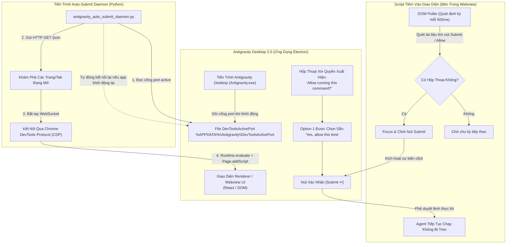

# 🚀 Antigravity Desktop 2.0 Auto-Submit Daemon

> **Giải pháp rảnh tay (Hands-free / YOLO mode) tối thượng cho Google Antigravity Desktop Agent (v2.0)**  
> Tự động phát hiện và phê duyệt các hộp thoại *"Allow running this command?"*, *"Allow verifying compilation..."* qua giao thức nội bộ **Chrome DevTools Protocol (CDP)** mà không cần menu Developer Tools hay tiện ích mở rộng bên thứ ba.

[English](README.md) | [Tiếng Việt](README_vi.md)

[](LICENSE)
[]()
[]()
[]()

---

## 📌 Vấn Đề Gặp Phải

Trên ứng dụng **Google Antigravity Desktop 2.0 (Agent Standalone App)**:
1. **Modal xin quyền liên tục**: Mỗi khi Agent chạy lệnh terminal (`git`, `Get-Process`, `python`, `py_compile`), hệ thống luôn dừng lại và hiển thị hộp thoại bắt buộc nhấn `Submit ↵` hoặc `Allow`.
2. **"Always allow" bị vô hiệu hóa bởi lệnh động**: Dù bạn đã chọn *"always allow in this project"*, các câu lệnh có tham số thay đổi (như PID trong `Get-Process -Id <PID>` hoặc đường dẫn file mới) vẫn bị xem là lệnh mới và tiếp tục làm gián đoạn luồng làm việc.
3. **Menu Developer Tools bị ẩn**: Trong bản cập nhật mới, mục `View -> Toggle Developer Tools` đã bị gỡ bỏ khỏi thanh menu chính, khiến người dùng không thể dán script console thủ công như trước.

---

## 🏗️ Sơ Đồ Kiến Trúc & Luồng Hoạt Động (Flowchart)

Ứng dụng Antigravity Desktop được xây dựng trên nền tảng **Electron**. Dù thanh menu DevTools bị ẩn, Electron vẫn luôn mở một cổng gỡ lỗi cục bộ và ghi số cổng vào tệp cấu hình:
`%APPDATA%\Antigravity\DevToolsActivePort`



---

## 💡 Điểm Nổi Bật

* **⚡ Tiêm CDP Trực Tiếp**: Giao tiếp trực tiếp với tiến trình hiển thị của Antigravity Desktop qua giao thức WebSocket chuẩn của Chrome DevTools.
* **🔄 Tự Phục Hồi & Tái Kết Nối**: Tự động phát hiện khi bạn tắt đi bật lại Antigravity Desktop và kết nối lại cổng mới ngay tức khắc.
* **📑 Giữ Trạng Thái Xuyên Suốt**: Đăng ký `Page.addScriptToEvaluateOnNewDocument` nên dù bạn chuyển tab hay mở hội thoại mới, tính năng auto-submit vẫn duy trì.
* **🪟 Chạy Ẩn 100% (Zero Window)**: Đi kèm launcher VBScript chạy nền hoàn toàn không hiện bất kỳ cửa sổ console đen nào.

---

## 🛠️ Cài Đặt Nhanh

### Yêu Cầu Hệ Thống
* Hệ điều hành: Windows 10 / 11
* Python 3.9 trở lên
* Cài đặt thư viện phụ thuộc:
  ```powershell
  pip install -r requirements.txt
  ```

---

## 🚀 Cách dùng (Desktop + IDE cùng lúc)

1. Mở **Antigravity Desktop** và **Antigravity IDE** như bình thường (icon Start / taskbar). Không cần launcher riêng cho từng app.
2. Bấm **một** file trong `launchers/`:
   * [`Auto_Submit_Antigravity.bat`](launchers/Auto_Submit_Antigravity.bat) — hiện log, nên dùng lần đầu.
   * [`Chay_Ngam_Auto_Submit.vbs`](launchers/Chay_Ngam_Auto_Submit.vbs) — chạy ẩn, không cửa sổ.
3. Daemon tự bấm `Submit` trên Desktop và trên extension trong IDE. Chỉ chạy **một** daemon.

Tắt: [`Stop_Auto_Submit.bat`](launchers/Stop_Auto_Submit.bat).

Lệnh Python (tùy chọn):

```powershell
py -3 -u scripts/antigravity_auto_submit_daemon.py
```

---

## 📋 MỤC PROMPT: Kích Hoạt Bằng AI Agent

Bạn có thể sao chép trực tiếp các Prompt dưới đây và gửi cho bất kỳ AI Coding Assistant nào (Antigravity IDE, Claude Code, Cursor, Windsurf, Devin, v.v.) để yêu cầu AI tự động kiểm tra và kích hoạt chức năng này cho bạn:

### Prompt 1: Dán trực tiếp cho AI Agent trên máy của bạn (Tiếng Việt)

```markdown
Hãy kích hoạt chế độ Auto-Submit cho ứng dụng Antigravity Desktop 2.0 trên máy của tôi theo cơ chế sau:

1. Đọc cổng Chrome DevTools Protocol (CDP) đang mở tại đường dẫn:
   `%APPDATA%\Antigravity\DevToolsActivePort` (thường là file 2 dòng, dòng đầu tiên là số port).
2. Gọi HTTP GET tới `http://127.0.0.1:<PORT>/json` để lấy danh sách các trang/tab loại "page" có chứa `webSocketDebuggerUrl`.
3. Kết nối WebSocket vào `webSocketDebuggerUrl` và gửi lệnh `Runtime.evaluate` cùng `Page.addScriptToEvaluateOnNewDocument` đoạn mã JavaScript sau:

```javascript
(() => {
  if (window.__agAutoSubmitActive) return 'already_active';
  window.__agAutoSubmitActive = true;
  console.log('[Antigravity Auto-Submit] Da kich hoat thanh cong.');

  setInterval(() => {
    try {
      const buttons = Array.from(document.querySelectorAll('button'));
      const submitBtn = buttons.find(b => {
        const text = (b.innerText || b.textContent || '').trim().toLowerCase();
        return (text === 'submit' || text.startsWith('submit') || text.includes('submit ↵')) &&
               !b.disabled &&
               b.offsetParent !== null;
      });

      if (submitBtn) {
        submitBtn.focus();
        submitBtn.click();
        console.log('[Antigravity Auto-Submit] Da tu dong click Submit vao luc:', new Date().toLocaleTimeString());
      }
    } catch (e) {
      console.error(e);
    }
  }, 500);

  return 'injected_successfully';
})();
```

4. Chạy tiến trình nền giám sát liên tục hoặc báo cáo lại trạng thái kích hoạt sau khi hoàn tất.
```

---

### Prompt 2: Khởi chạy từ Repository đã Clone

```markdown
Hãy kiểm tra và khởi chạy file daemon `scripts/antigravity_auto_submit_daemon.py` trong repository `antigravity-desktop-auto-submit` dưới dạng tiến trình nền (background daemon). Xác nhận rằng daemon đã kết nối thành công tới cổng CDP của Antigravity Desktop và đang tự động duyệt các hộp thoại xin quyền.
```

---

### Prompt 3: English Version

```markdown
Please activate hands-free Auto-Submit mode for Antigravity Desktop 2.0 on this machine:

1. Read the active Chrome DevTools Protocol (CDP) port from `%APPDATA%\Antigravity\DevToolsActivePort`.
2. Fetch target pages from `http://127.0.0.1:<PORT>/json` and get `webSocketDebuggerUrl` for active "page" types.
3. Connect via WebSocket and evaluate an auto-clicker script via `Runtime.evaluate` and `Page.addScriptToEvaluateOnNewDocument`.
4. The injected script monitors the DOM every 500ms and triggers click events on any visible, enabled `Submit ↵` or `Allow` buttons.
5. Confirm successful injection and maintain the monitoring loop.
```

---

## 📂 Cấu Trúc Repository

```text
antigravity-desktop-auto-submit/
├── README.md                               # Tài liệu tiếng Anh kèm sơ đồ luồng
├── README_vi.md                            # Tài liệu tiếng Việt
├── LICENSE                                 # Giấy phép nguồn mở MIT
├── requirements.txt                        # Thư viện Python phụ thuộc
├── .gitignore                              # Cấu hình bỏ qua file rác / cache
├── prompts/
│   └── activate_auto_submit.md             # Tệp prompt độc lập dùng cho AI Agent
├── scripts/
│   ├── antigravity_auto_submit_daemon.py   # Daemon: CDP Desktop + UIA IDE
│   └── uia_permission_submit.py            # Bấm Submit trên Antigravity IDE
└── launchers/
    ├── Auto_Submit_Antigravity.bat         # Bật daemon (hiện log)
    ├── Chay_Ngam_Auto_Submit.vbs           # Bật daemon ẩn
    └── Stop_Auto_Submit.bat                # Tắt daemon
```

Một daemon phủ cả hai: Desktop qua CDP, IDE/extension qua UI Automation. Không khởi động lại app, không cổng 9222.

---

## ⚠️ Lưu Ý An Toàn (Safety Guidelines)

* Khi bật chế độ tự động duyệt, mọi lệnh dòng lệnh do Agent sinh ra (`git`, biên dịch mã nguồn, kiểm tra tiến trình) sẽ được thực thi ngay lập tức mà không cần xác nhận thủ công.
* Hãy đảm bảo repository làm việc của bạn đã được commit Git định kỳ (`git status`) để có thể rollback khi cần thiết.

---

## 📜 Giấy Phép (License)

Dự án được phân phối dưới giấy phép [MIT License](LICENSE).
Tự do sử dụng, chỉnh sửa và đóng góp cho cộng đồng!
